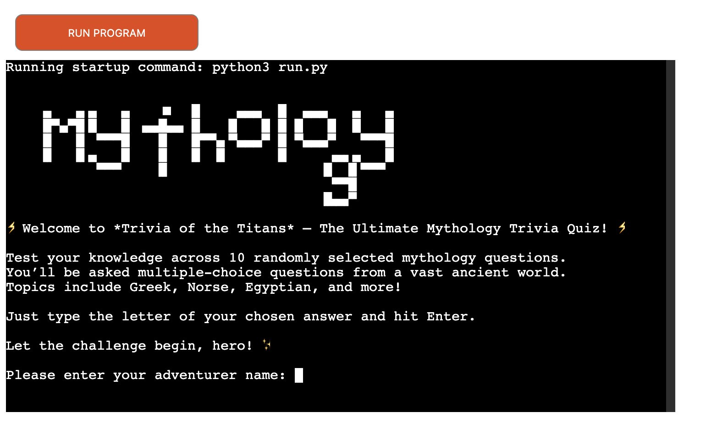
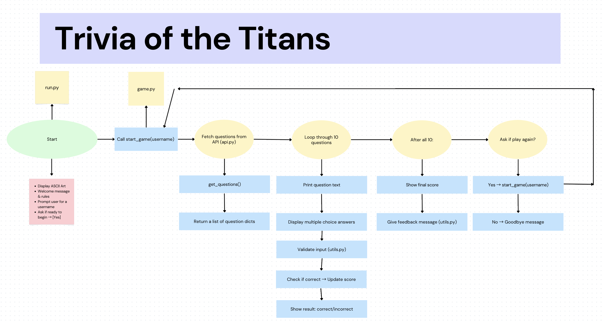
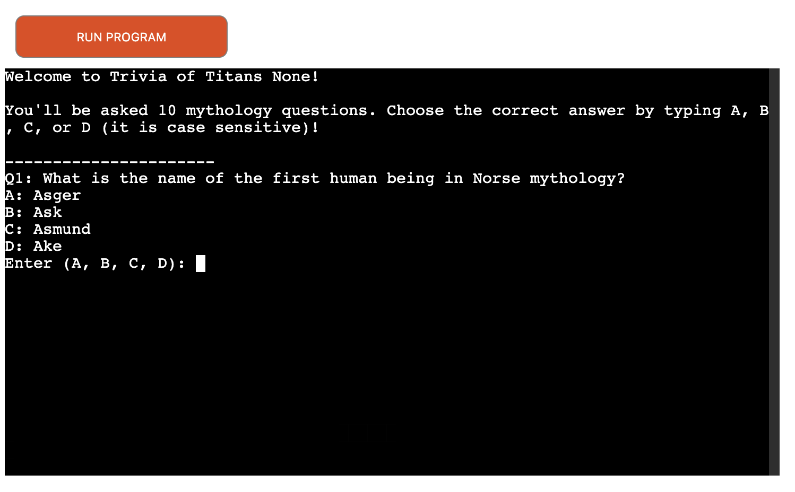
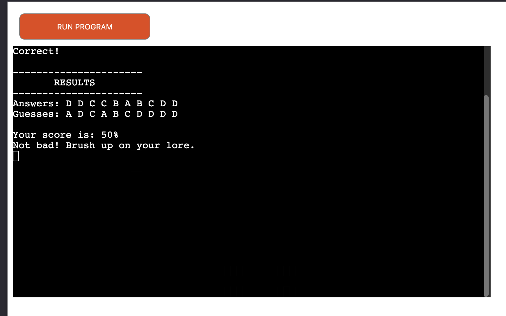
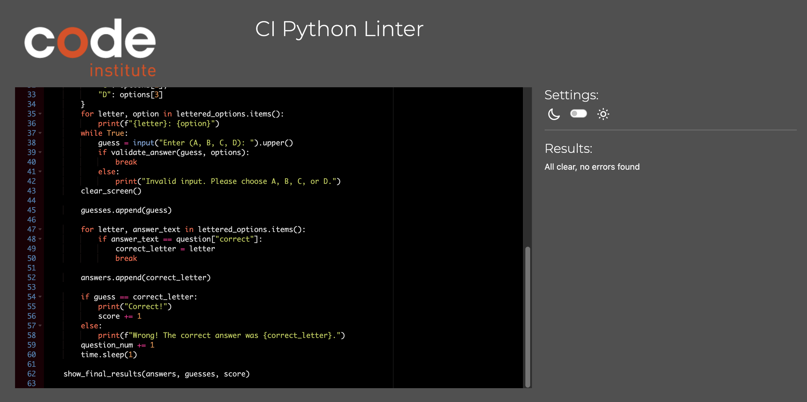
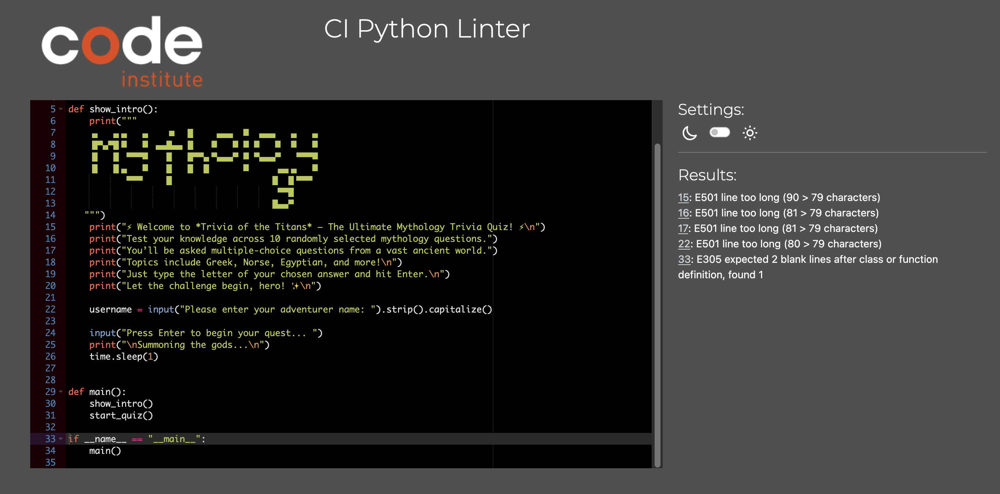
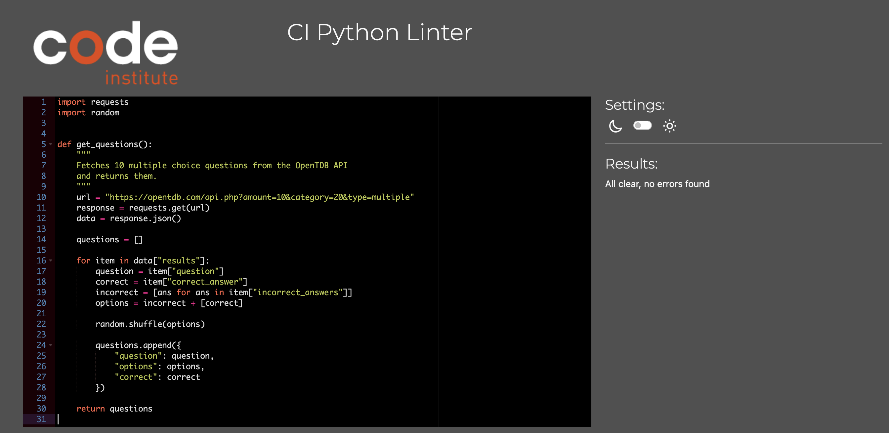
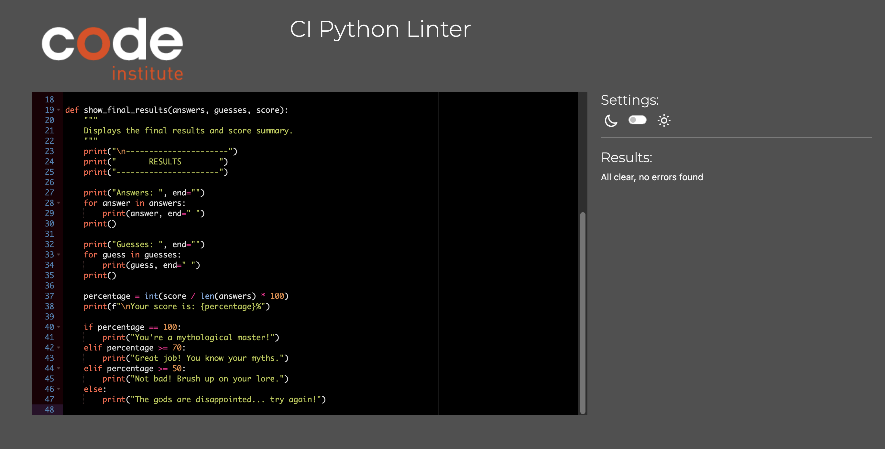

# Trivia of the Titans

**Trivia of the Titans** is a command-line Python quiz game that tests your knowledge of mythology using randomly generated questions from the Open Trivia Database. The player answers 10 mythological questions and gets their final score at the end. 

[Live version of the project – hosted on Heroku]()

---
### Project Goals

The goal of this project is to create an interactive and educational Python quiz application that allows users to test their mythology knowledge in a fun and engaging way. The quiz fetches dynamic questions from the Open Trivia Database and validates user responses. The app is modular, allowing for scalability and easier maintenance, and is deployed on Heroku for accessible use through a browser-based terminal.

---
## User Stories

- As a user, I want to play a quiz game about mythology.
- As a user, I want the questions to be different every time I play.
- As a user, I want to choose from multiple-choice answers and receive feedback if my input is incorrect.
- As a user, I want to see my score at the end of the game.
- As a user, I want a clean and readable terminal experience.
- As a developer, I want to keep my code organized using modules.

---

## Flowchart
- Using Canva I made a flowchart based on the requirements, the user stories and project goals:

---

## How to Play

- Launch the app in the terminal.
- Choose to begin the mythological quiz.
- You’ll be asked **10 random mythology-themed questions**.
- For each question, select the correct answer from multiple choices.
- At the end, your score will be revealed!

Questions are pulled dynamically from [OpenTDB](https://opentdb.com), making each game different!

---

## Features

### Existing Features

- 10 randomised mythology questions per game
- Multiple choice answers
- Input validation: accepts only A/B/C/D (case-insensitive)
- Error messages for invalid input
- Final score presented at the end
- Live API integration (OpenTDB)
- Clean modular codebase (separated into `run.py`, `game.py`, `api.py`, `utile.py`)

### Future Features

- Category or difficulty selection
- Scoreboard or high score tracking
- Timed answers
- Save stats to file or database
- More myth themes (Norse, Egyptian, etc.)

## Technologies Used

### Languages Used
- **Python**

### Programs & Tools Used
- **Heroku**: For app deployment using Code Institute's mock terminal.
- **PEP8 Linter**: To ensure Python code style and formatting consistency.
- **Online IDE Syntax Checker**: Used to manually check syntax and logic.
- **Code Institute Terminal**: Cloud-based terminal used during development.
- **Gitpod**: Cloud-based IDE.
- **ASCII generator** [patorjk](https://patorjk.com/software/taag/#p=display&f=Graffiti&t=Type%20Something%20)

### Python Libraries & Modules
- **requests**: For making API calls to the Open Trivia Database.
- **random**: Used to shuffle multiple choice answers.
- **os**: For clearing the terminal screen for a cleaner UI.
- **html**: To unescape special characters from HTML-encoded trivia questions.

---

## Data Model

- Uses the **Open Trivia Database API** to fetch quiz questions.
- Each API response includes:
  - `question` (text)
  - `correct_answer`
  - `incorrect_answers` (list)
- These are combined and shuffled before being shown to the user.

---

### Code Organization

To improve readability, maintainability, and scalability, the Python codebase was split into multiple files:

- `run.py` – Main program that starts the app.
- `api.py` – Handles API requests and parsing.
- `utils.py` – Contains helper functions like screen clearing and input validation.
- `game.py` – Controls the core game logic and user flow.

This approach follows standard Python modular programming practices, as explained in this helpful [DataCamp article on Python Modules](https://www.datacamp.com/tutorial/modules-in-python).

---

## Testing

### Manual Tests
- Placed the individual section of the code in PEP8 CI Linter and no errors were detected.
- Tested in an online IDE python syntax checker [ONLINE IDE](https://www.online-ide.com/online_python_syntax_checker)

### PEP8 Validation

I passed all my files through the [Code Institute Python Linter](https://pep8ci.herokuapp.com/) of which all but one gave back no errors. The remaining one I was not able to correct on time. 

---

## Bugs

### Solved Bugs
- **Heroku Deployment Issues**:  
  I experienced several difficulties getting the app running on Heroku. Despite having the correct `requirements.txt`, `Procfile`, and buildpacks, the deployment initially failed. With support from both my mentors, we used a variety of methods to debug the issue:
  - Carefully inspected Heroku logs via the Heroku dashboard and `heroku logs --tail` command.
  - Installed the Heroku CLI in my local VS Code environment to run detailed diagnostics and view error output in real-time.
  - Compared my setup to working examples.
  - Double-checked environment variables (Config Vars) and ensured they matched the expected format and values.
  Eventually, the app was successfully deployed after adjusting several configurations based on these troubleshooting methods.

### Remaining Bugs

- None known at this time.

---

## 🚀 Deployment

This project is deployed using Code Institute’s mock terminal for Heroku.

### Deployment Steps:

## 🚀 Deployment on Heroku

The project was deployed using [Heroku](https://heroku.com) with Code Institute's mock terminal template.

### Prerequisites
Ensure the following files are present in your repository:
- `requirements.txt` – lists all required Python dependencies.
- `Procfile` – tells Heroku how to run the app (e.g., `web: python run.py` or similar).
- `runtime.txt` – specifies the Python version.
- `index.js` – included as part of the Code Institute Heroku deployment template to keep Heroku's dyno alive.
- `creds.json` – if using APIs requiring credentials (optional, set as Config Var).

---

### Deployment:

1. **Create a Heroku Account**  
   Go to [Heroku](https://id.heroku.com/login) and sign up or log in.

2. **Create a New Heroku App**  
   - From your Heroku dashboard, click **"New" > "Create new app"**.
   - Enter a unique name (e.g., `trivia-of-the-titans`).
   - Choose your region (e.g., Europe or United States).
   - Click **"Create app"**.

3. **Set Up Buildpacks**  
   - Go to the **Settings** tab of your app.
   - Scroll to **Buildpacks**, click **"Add Buildpack"**.
     - First, select **Python** and click **Save Changes**.
     - Then, add **Node.js** and click **Save Changes** again.
   - **Python must be listed above Node.js**. You can drag them to reorder if needed.

4. **Configure Environment Variables (Config Vars)**  
   - Still under **Settings**, click **"Reveal Config Vars"**.
   - Add any needed environment variables:
     - For example:
       - **Key:** `PORT` → **Value:** `8000`
       - If using external APIs (e.g., Google Sheets): add `CREDS` and paste your `creds.json` content.

5. **Connect GitHub Repository to Heroku**
   - Navigate to the **Deploy** tab.
   - Under **Deployment method**, choose **GitHub**.
   - Click **"Connect to GitHub"**.
   - Search for your repository by name and click **"Connect"**.

6. **Deploy Your App**
   - Scroll down to the **Manual Deploy** section.
   - Choose the branch you want to deploy (usually `main` or `master`).
   - Click the **"Deploy Branch"** button.
   - Wait until the build process completes — if successful, you’ll get a “Your app was successfully deployed” message.

7. **View Your App Live**
   - Once deployment is complete, click **"View"** to open your live app in the browser.
   - Example URL: `https://trivia-of-the-titans.herokuapp.com/`

---

## Credits
- **Mentor Support**: A heartfelt thank you to my mentor for their ongoing guidance, encouragement, and support throughout the development of this project. Your insights were invaluable in helping me grow as a developer.
- **Last-Minute Mentor Assistance**:  I'm also incredibly grateful to the mentor who kindly stepped in at the last minute.
- **Code Institute Tutoring Support**:  
  Many thanks to the wider Code Institute team for providing helpful resources and guidance whenever needed.

## Resources:
- Youtube video [Bro Code](https://www.youtube.com/watch?v=zehwgTB0vV8)
- Tutorial website [Datacamp](https://www.datacamp.com/tutorial/modules-in-python)